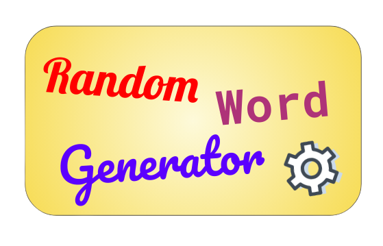

# Random Word Generator


<p align="center">
</a>
</p>

## __How to install this library?__
```
pip3 install RandomWordGenerator

OR

pip install RandomWordGenerator
```

## __Which other python packages are needed to be installed?__
* No need of any external packages
* Only Python version >= 3 is required


## __What this library does?__
It helps us to generate random words i.e random noise in text data which is helpful in many text augmentation based tasks, NER, etc.

## __Which methods are available currently in this library?__
<style type="text/css">
.tg  {border-collapse:collapse;border-spacing:0;}
.tg td{border-color:black;border-style:solid;border-width:1px;font-family:Arial, sans-serif;font-size:14px;
  overflow:hidden;padding:10px 5px;word-break:normal;}
.tg th{border-color:black;border-style:solid;border-width:1px;font-family:Arial, sans-serif;font-size:16px;
  font-weight:normal;overflow:hidden;padding:10px 5px;word-break:normal;}
.tg .tg-d9cy{background-color:#00009b;border-color:#9b9b9b;color:#efefef;text-align:left;vertical-align:top}
</style>
<table class="tg">
<thead>
  <tr>
    <th class="tg-d9cy">Method</th>
    <th class="tg-d9cy">Args</th>
    <th class="tg-d9cy">Description</th>
  </tr>
</thead>
<tbody>
  <tr>
    <td class="tg-d9cy">.generate()</td>
    <td class="tg-d9cy">None</td>
    <td class="tg-d9cy"><span style="font-weight:400;font-style:normal">This will return a randomly generated word</span></td>
  </tr>
  <tr>
    <td class="tg-d9cy">.getList(num_of_words)</td>
    <td class="tg-d9cy">num_of_words</td>
    <td class="tg-d9cy"><span style="font-weight:400;font-style:normal">This will return list of random words</span></td>
  </tr>
</tbody>
</table>


## __Setting to look out before generating random words__

### Basic 
```
from RandomWordGenerator import RandomWord

# Creating a random word object
rw = RandomWord(max_word_size,
                constant_word_size=True,
                include_digits=False,
                special_chars=r"@_!#$%^&*()<>?/\|}{~:",
                include_special_chars=False)
```
<style type="text/css">
.tg  {border-collapse:collapse;border-spacing:0;}
.tg td{border-color:black;border-style:solid;border-width:1px;font-family:Arial, sans-serif;font-size:14px;
  overflow:hidden;padding:10px 5px;word-break:normal;}
.tg th{border-color:black;border-style:solid;border-width:1px;font-family:Arial, sans-serif;font-size:16px;
  font-weight:normal;overflow:hidden;padding:10px 5px;word-break:normal;}
.tg .tg-cbj7{background-color:#f8a102;border-color:#000000;color:#000000;text-align:center;vertical-align:top}
.tg .tg-oj67{background-color:#f8a102;border-color:#000000;color:#000000;text-align:left;vertical-align:top}
</style>
<table class="tg" style="undefined;table-layout: fixed; width: 538px">
<colgroup>
<col style="width: 149px">
<col style="width: 85px">
<col style="width: 80px">
<col style="width: 189px">
</colgroup>
<thead>
  <tr>
    <th class="tg-cbj7">Args</th>
    <th class="tg-cbj7">Data Type</th>
    <th class="tg-cbj7">Default</th>
    <th class="tg-oj67">Description</th>
  </tr>
</thead>
<tbody>
  <tr>
    <td class="tg-oj67">max_word_size</td>
    <td class="tg-oj67">int</td>
    <td class="tg-oj67">10</td>
    <td class="tg-oj67">Represents maximum length of randomly generated word</td>
  </tr>
  <tr>
    <td class="tg-oj67">constant_word_size</td>
    <td class="tg-oj67">bool</td>
    <td class="tg-oj67">True</td>
    <td class="tg-oj67">Represents word length of<br>randomly generated word</td>
  </tr>
  <tr>
    <td class="tg-oj67">include_digits</td>
    <td class="tg-oj67">bool</td>
    <td class="tg-oj67">False</td>
    <td class="tg-oj67">Represents whether or not to include digits in generated words</td>
  </tr>
  <tr>
    <td class="tg-oj67">special_chars</td>
    <td class="tg-oj67">regex/string</td>
    <td class="tg-oj67">r"@_!#$%^&amp;*()&lt;&gt;?/\\<br>|}{~:"</td>
    <td class="tg-oj67">Represents a regex string of all specials character you want to include in generated words</td>
  </tr>
  <tr>
    <td class="tg-oj67">include_special_chars</td>
    <td class="tg-oj67">bool</td>
    <td class="tg-oj67">False</td>
    <td class="tg-oj67">Represents inclusion of  special characters in generated words</td>
  </tr>
</tbody>
</table>


## __How to get started with this library?__

1.  Simple random word generation with constant word size
    ```
    from RandomWordGenerator import RandomWord

    rw = RandomWord(max_word_size=5)

    print(rw.generate())
    ```
    ```
    Output will be some random word like
    > hdsjq
    ```

2. Simple random word generation with variable word size
    ```
    from RandomWordGenerator import RandomWord

    rw = RandomWord(max_word_size=5,
                    constant_word_size=False)

    print(rw.generate())
    ```
    ```
    Output will be some random word like
    > gw
    ```
3. Random word generation with constant word size and including special character included
    ```
    from RandomWordGenerator import RandomWord

    rw = RandomWord(max_word_size=5,
                    constant_word_size=True,
                    special_chars=r"@#$%.*",
                    include_special_chars=True)

    print(rw.generate())
    ```
    ```
    Output will be some random word like
    > gsd$
    ```
4. If we want randomly generated words in list we just have to input the argument with number of words we want
    ```
    from RandomWordGenerator import RandomWord

    rw = RandomWord(max_word_size=5,
                    constant_word_size=False)

    print(rw.getList(num_of_random_words=3)
    ```
    ```
    Output will be some random word like
    > ['adjse', 'qytqw', ' klsdf', 'ywete', 'klljs']

    ```

## __Application__

* In cases where we need to add  random noise in text
* Name Entity Relation extraction based tasks
* Text Data Augmentation based tasks


## Author
I will be happy connect with you guys!!

[Linkedin](https://www.linkedin.com/in/abhishek-c-salian/)

[Twitter](https://www.twitter.com/@ACSalian)


Any suggestions are most welcome.

#